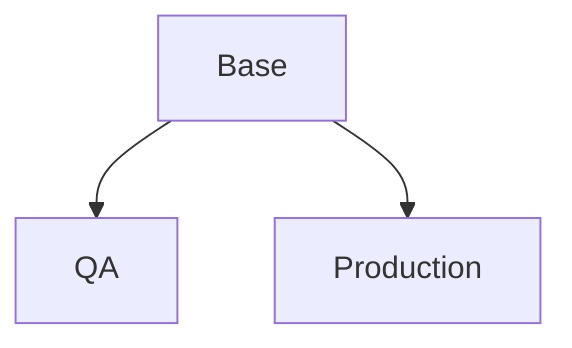
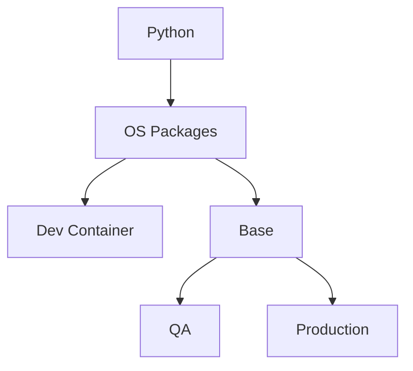

# Multi-stage Dockerfile

## Example 1

The simplest example. Each box as a different stage.




```Dockerfile
###################
# Base stage
FROM docker.io/library/python:slim AS base

RUN echo Base stage


###################
# QA stage
FROM base AS qa

RUN echo QA stage


###################
# Production stage
FROM base AS prod

RUN echo Production stage
```

Set the desired target stage to build with 

```bash
docker build --target qa ...
```


## Example 2

Let's add some details.

The Quality Assurance (QA) is close to the Production stage, but also includes QA tools such as `pre-commit` and `git` etc.


## Example 3


